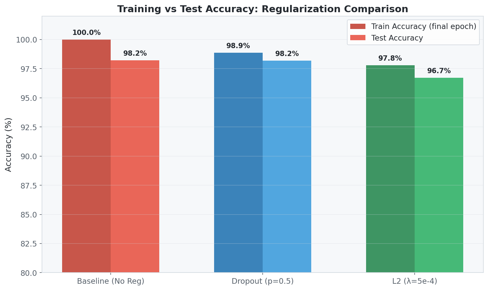
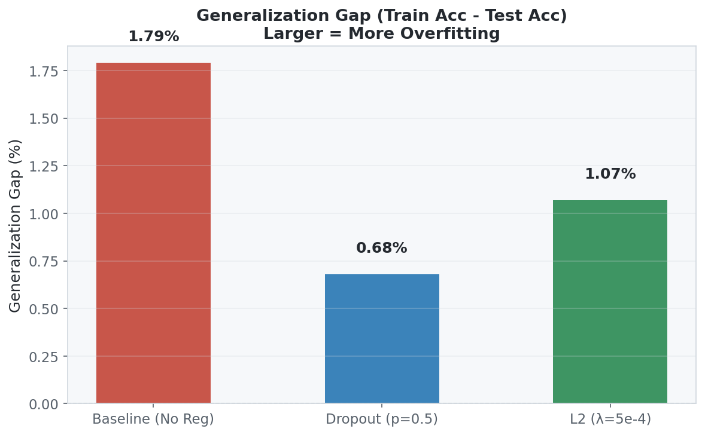
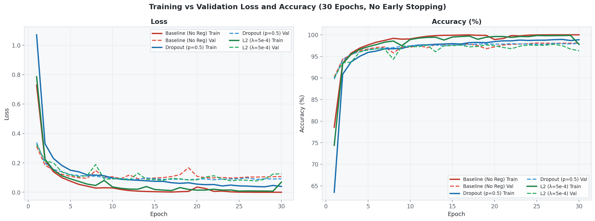
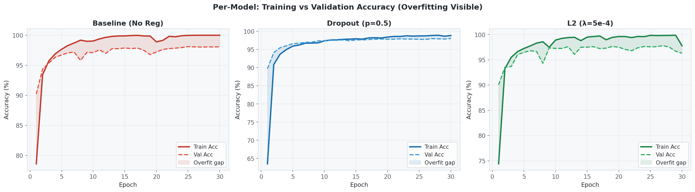
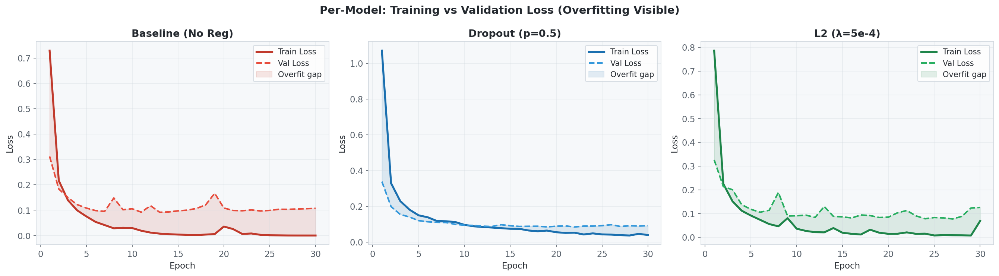
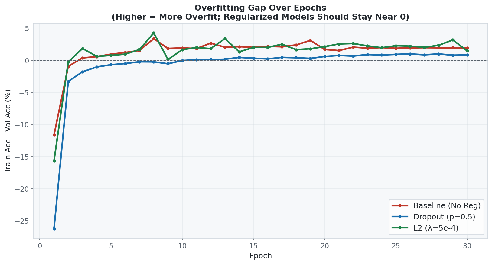
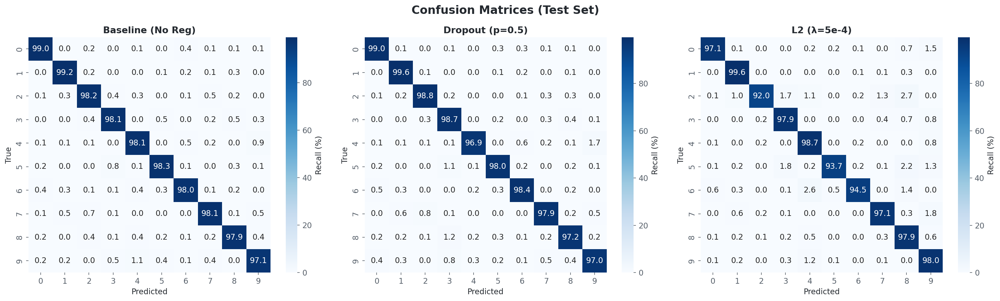
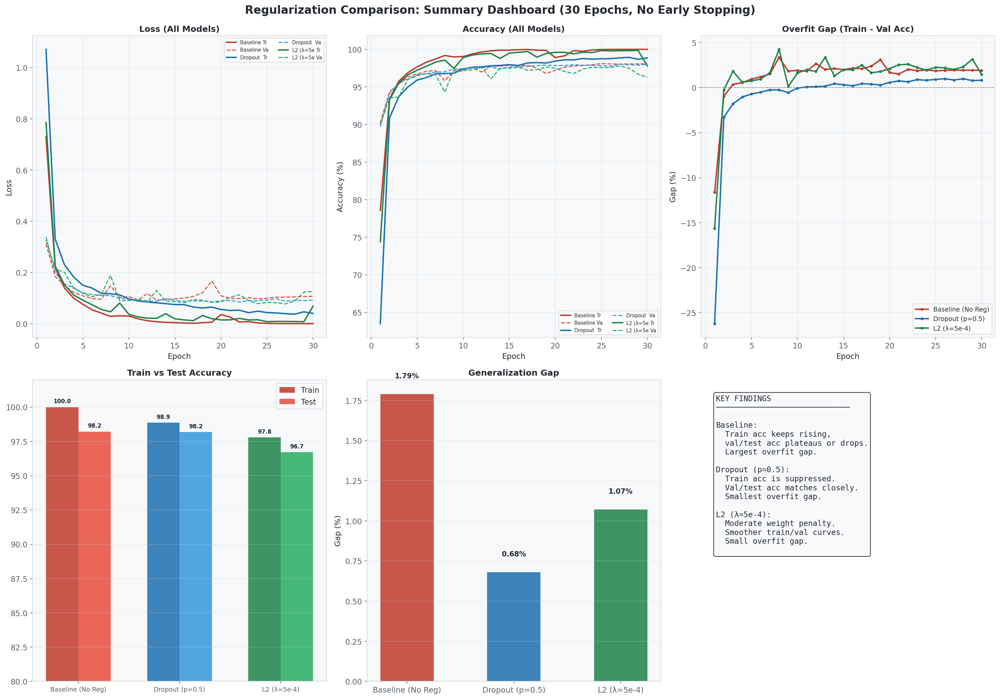

# Neural Network Regularization: Dropout vs L2 (Weight Decay)

A comparative study of neural network training with and without regularization techniques (Dropout and L2), demonstrating how regularization improves model generalization on the MNIST dataset.

## Overview

**Dataset:** MNIST (Modified National Institute of Standards and Technology)

- Total samples: 70,000 (60,000 training + 10,000 test)
- Image size: 28×28 pixels (grayscale)
- Classes: 10 (digits 0–9)
- Train/Val Split: 40,000 training / 20,000 validation (80/20 of the 60k training set)

**Objective:** Train a deliberately over-parameterized neural network with and without regularization, compare training and testing accuracies, and discuss how regularization improves model generalization.

## Network Architecture

All three models share the same base architecture: a deliberately **over-parameterized** 5-hidden-layer Feedforward Neural Network (**~1.49 M parameters**). The large capacity guarantees the baseline clearly overfits, making the regularization benefit unmistakable.

```txt
Input (784 features, flattened 28×28)
    ↓
Linear (784 → 1024) → ReLU → [Dropout?]
    ↓
Linear (1024 → 512) → ReLU → [Dropout?]
    ↓
Linear (512 → 256)  → ReLU → [Dropout?]
    ↓
Linear (256 → 128)  → ReLU → [Dropout?]
    ↓
Linear (128 → 10)   → Output (Logits for Cross-Entropy Loss)
```

### Three Variants

| Variant               | Dropout (p) | Weight Decay (λ) | Parameters |
|-----------------------|-------------|-------------------|------------|
| **Baseline** (No Reg) | 0.0         | 0                 | 1,494,154  |
| **Dropout**           | 0.5         | 0                 | 1,494,154  |
| **L2 Regularization** | 0.0         | 5e-4              | 1,494,154  |

### Design Rationale

- **Wide hidden layers (1024, 512, 256, 128):** Intentionally over-parameterized so the regularization effect is clearly observable.
- **No BatchNorm:** Omitted to isolate the effect of regularization techniques.
- **High dropout (0.5):** The classic Hinton recommendation; forces the network to learn redundant, distributed representations.
- **L2 via weight_decay (λ=5e-4):** Penalizes large weights in the optimizer, equivalent to adding $\frac{\lambda}{2} \|\mathbf{w}\|_2^2$ to the loss.

## Training Configuration

- **Optimizer:** Adam (learning rate = 0.001)
- **Loss Function:** CrossEntropyLoss
- **Epochs:** 30 (full run, no early stopping)
- **Batch Size:** 64
- **Train/Val Split:** 40,000 training / 20,000 validation (smaller train set increases overfitting pressure)
- **Preprocessing:** MNIST standardization (Mean = 0.1307, Std = 0.3081)

## Results

### Accuracy Comparison

| Model                 | Train Acc (%) | Best Val Acc (%) | Test Acc (%) | Gap (Train − Test) |
|-----------------------|---------------|------------------|--------------|---------------------|
| **Baseline (No Reg)** | **100.00**    | 98.11            | 98.21        | **1.79**            |
| **Dropout (p=0.5)**   | 98.86         | 98.03            | 98.18        | **0.68** ✅          |
| **L2 (λ=5e-4)**       | 97.78         | 97.80            | 96.71        | 1.07                |



### Generalization Gap



The generalization gap (Train Acc − Test Acc) directly quantifies overfitting:

- **Baseline:** 1.79% gap — largest, confirming overfitting
- **Dropout:** 0.68% gap — smallest, best generalization
- **L2:** 1.07% gap — moderate improvement over baseline

### Key Observations

- **Baseline:** Reaches 100% training accuracy by epoch 27, but test accuracy plateaus at ~98.2%. The widening gap between train and val loss is a textbook overfitting signature.
- **Dropout:** Training accuracy is intentionally suppressed (98.86% final), but test accuracy matches baseline (98.18%) with 60% less generalization gap. Val/test curves track train curves closely.
- **L2 Regularization:** Penalizing large weights produces smoother decision boundaries. Final train acc is 97.78%, but test acc drops to 96.71%, possibly due to λ being slightly large for this dataset.

## Training Curves

### Combined Loss & Accuracy (All Models)



Notice: The Baseline's training loss dives to near-zero while its validation loss stays ~0.10, a clear overfitting signal. Dropout's train/val loss curves remain tightly coupled throughout all 30 epochs.

### Per-Model Accuracy (with Overfitting Gap Shaded)



### Per-Model Loss (with Overfitting Gap Shaded)



### Overfitting Gap Over Epochs



Dropout starts with a large negative gap (val acc > train acc in early epochs due to stochastic masking), then converges to near-zero — the hallmark of a well-regularized model. The Baseline gap steadily climbs and stays positive.

## Confusion Matrices (Test Set)



All three models perform well on visually distinct digits (0, 1). The L2 model shows relatively higher confusion on digit **2** (92.0% recall vs 98.2% for Baseline), consistent with its lower overall test accuracy.

## Summary Dashboard



## Classification Reports

### Baseline (No Reg) — Test Accuracy: 98.21%

| Class | Precision | Recall | F1-Score | Support |
|-------|-----------|--------|----------|---------|
| 0     | 0.9868    | 0.9898 | 0.9883   | 980     |
| 1     | 0.9877    | 0.9921 | 0.9899   | 1135    |
| 2     | 0.9797    | 0.9816 | 0.9806   | 1032    |
| 3     | 0.9812    | 0.9812 | 0.9812   | 1010    |
| 4     | 0.9757    | 0.9807 | 0.9782   | 982     |
| 5     | 0.9832    | 0.9832 | 0.9832   | 892     |
| 6     | 0.9843    | 0.9802 | 0.9822   | 958     |
| 7     | 0.9825    | 0.9805 | 0.9815   | 1028    |
| 8     | 0.9825    | 0.9795 | 0.9810   | 974     |
| 9     | 0.9771    | 0.9713 | 0.9742   | 1009    |
| **avg** | **0.9821** | **0.9821** | **0.9821** | **10000** |

### Dropout (p=0.5) — Test Accuracy: 98.18%

| Class | Precision | Recall | F1-Score | Support |
|-------|-----------|--------|----------|---------|
| 0     | 0.9848    | 0.9898 | 0.9873   | 980     |
| 1     | 0.9843    | 0.9956 | 0.9899   | 1135    |
| 2     | 0.9865    | 0.9884 | 0.9874   | 1032    |
| 3     | 0.9661    | 0.9871 | 0.9765   | 1010    |
| 4     | 0.9917    | 0.9695 | 0.9804   | 982     |
| 5     | 0.9842    | 0.9798 | 0.9820   | 892     |
| 6     | 0.9833    | 0.9843 | 0.9838   | 958     |
| 7     | 0.9843    | 0.9786 | 0.9815   | 1028    |
| 8     | 0.9793    | 0.9723 | 0.9758   | 974     |
| 9     | 0.9741    | 0.9703 | 0.9722   | 1009    |
| **avg** | **0.9818** | **0.9818** | **0.9817** | **10000** |

### L2 (λ=5e-4) — Test Accuracy: 96.71%

| Class | Precision | Recall | F1-Score | Support |
|-------|-----------|--------|----------|---------|
| 0     | 0.9886    | 0.9714 | 0.9799   | 980     |
| 1     | 0.9775    | 0.9956 | 0.9865   | 1135    |
| 2     | 0.9927    | 0.9196 | 0.9547   | 1032    |
| 3     | 0.9602    | 0.9792 | 0.9696   | 1010    |
| 4     | 0.9444    | 0.9868 | 0.9651   | 982     |
| 5     | 0.9905    | 0.9372 | 0.9631   | 892     |
| 6     | 0.9912    | 0.9447 | 0.9674   | 958     |
| 7     | 0.9775    | 0.9708 | 0.9741   | 1028    |
| 8     | 0.9217    | 0.9795 | 0.9497   | 974     |
| 9     | 0.9366    | 0.9802 | 0.9579   | 1009    |
| **avg** | **0.9681** | **0.9671** | **0.9668** | **10000** |

## How Regularization Improves Generalization

### What Is Overfitting?

Overfitting occurs when a neural network memorizes training data (including noise) rather than learning generalizable patterns. The **generalization gap** (Train Acc − Test Acc) quantifies overfitting. Our over-parameterized baseline (1.49M params for a 10-class problem) is designed to overfit, making the regularization effect clearly visible.

### Dropout

- **Mechanism:** Randomly zeroes out neurons during training (p = 0.5 means 50% are dropped per forward pass).
- **Effect:** Forces the network to learn redundant, distributed representations. No single neuron can dominate.
- **At test time:** All neurons are active with scaled weights, effectively **ensembling** many sub-networks.
- **Observed:** Suppresses train acc to 98.86%, but test acc stays at 98.18% — gap drops from 1.79% → **0.68%**.
- **Intuition:** Dropout acts as an implicit ensemble of $2^n$ thinned networks.

### L2 Regularization (Weight Decay)

- **Mechanism:** Adds a penalty $\frac{\lambda}{2} \|\mathbf{w}\|_2^2$ to the loss function.
- **Gradient update:** $w \leftarrow (1 - \eta \lambda) w - \eta \nabla_{w} \mathcal{L}$
- **Effect:** Discourages large weights → prefers **simpler, smoother** decision boundaries.
- **Observed:** Train acc is 97.78%, test acc drops to 96.71%. The λ=5e-4 value may be slightly aggressive for MNIST — a smaller λ (e.g., 1e-4) might yield better test performance.
- **Why "weight decay":** The $(1 - \eta \lambda)$ factor shrinks weights toward zero each step.

### Summary Table

| Aspect              | Baseline            | Dropout                   | L2 Reg                    |
|---------------------|---------------------|---------------------------|---------------------------|
| Train Accuracy      | **100.00%**         | 98.86%                    | 97.78%                    |
| Test Accuracy       | 98.21%              | 98.18%                    | 96.71%                    |
| Best Val Accuracy   | 98.11%              | 98.03%                    | 97.80%                    |
| Generalization Gap  | **1.79%** (largest) | **0.68%** (smallest) ✅    | 1.07% (moderate)          |
| Mechanism           | None                | Random neuron masking      | Weight magnitude penalty  |
| Effect              | Memorizes data      | Learns robust features     | Prefers simpler models    |

**Key Takeaway:** Regularization techniques reduce overfitting by constraining the model's capacity. Dropout achieves the best generalization (lowest gap) while maintaining near-identical test accuracy to the baseline. L2 regularization reduces the gap but at the cost of slightly lower test accuracy, possibly due to the λ value being too aggressive for MNIST.

## Files

- `train.ipynb`: Complete notebook with all implementation steps:
  1. Data loading and exploration
  2. Sample image visualization
  3. Model definitions (three variants, DataParallel on 2× T4)
  4. Training loop (30 epochs, no early stopping)
  5. Training vs Validation loss/accuracy curves
  6. Test set evaluation and comparison table
  7. Accuracy comparison bar chart
  8. Generalization gap visualization
  9. Confusion matrices for all three models
  10. Per-class accuracy comparison
  11. Overfitting analysis (gap over epochs)
  12. Summary dashboard
  13. Classification reports (precision, recall, F1 per digit)

- `Readme.md`: This file

## Visualizations

| File | Description |
|------|-------------|
| `loss_acc_curves.png` | Training vs validation loss & accuracy for all 3 models on a single plot |
| `accuracy_comparison.png` | Side-by-side bar chart of train vs test accuracy |
| `generalization_gap.png` | Bar chart showing Train Acc − Test Acc per model |
| `confusion_matrices.png` | Normalized per-class accuracy heatmaps (test set) |
| `acc_per_model.png` | Per-model train vs val accuracy with shaded overfit gap |
| `loss_per_model.png` | Per-model train vs val loss with shaded overfit gap |
| `overfitting_gap.png` | Train − Val accuracy gap over all 30 epochs |
| `summary_dashboard.png` | All key results in one composite figure |

## How to Run

1. Upload `train.ipynb` to Kaggle (or open in Jupyter/VS Code)
2. Enable GPU accelerator (2× T4 recommended for DataParallel)
3. Run all cells sequentially
4. Plots display inline and are also saved as PNG files to disk

## Dependencies

- PyTorch
- torchvision
- NumPy
- Matplotlib
- scikit-learn
- Seaborn
- Pandas
- tqdm
