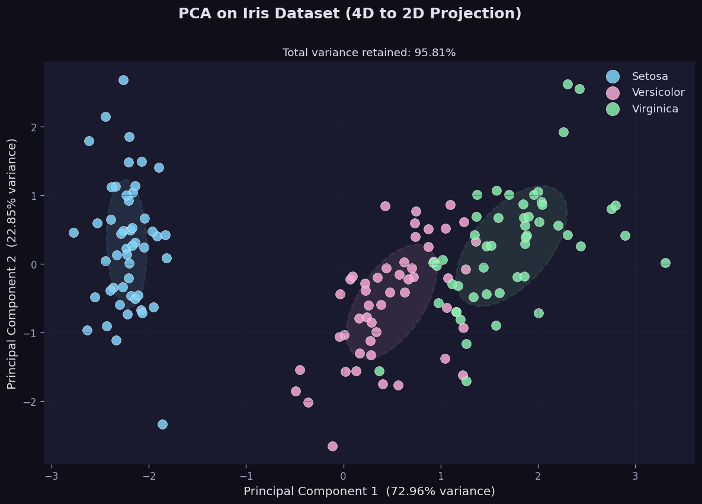
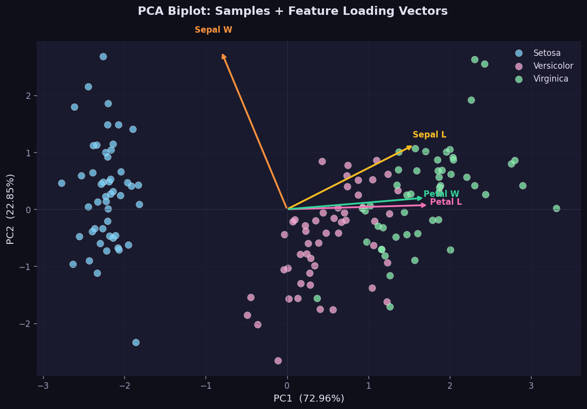
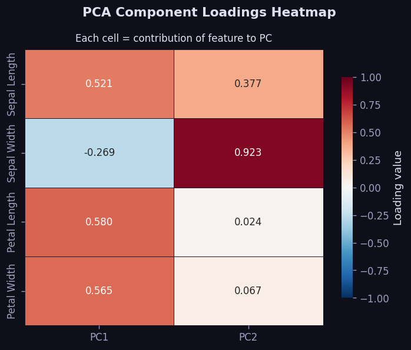
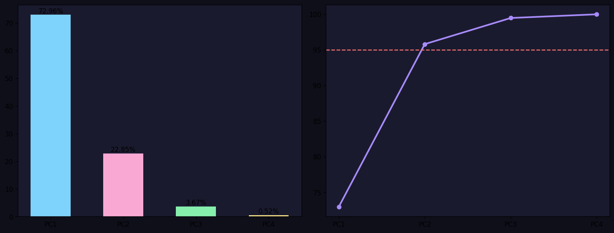
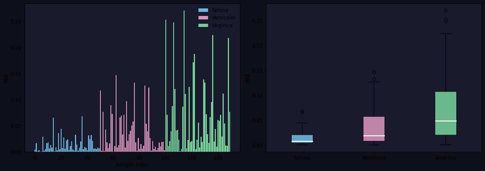

# Principal Component Analysis (PCA) on the Iris Dataset

A complete implementation of Principal Component Analysis (PCA) to reduce the Iris dataset from 4 dimensions to 2, enabling clear visualization and analysis of the three flower species.

## Overview

**Dataset:** Iris, the classic benchmark for multivariate analysis

- **Samples:** 150 (50 per class: Setosa, Versicolor, Virginica)
- **Features (4):** Sepal Length, Sepal Width, Petal Length, Petal Width
- **Goal:** Compress 4D → 2D while retaining maximum variance

## PCA Explained

**Principal Component Analysis (PCA)** is an unsupervised dimensionality reduction technique that transforms correlated features into a smaller set of uncorrelated **principal components**, ordered by the amount of variance they explain.

### How It Works

1. **Standardize** features to zero mean and unit variance
2. **Compute the Covariance Matrix** $C = \frac{1}{n-1}X^TX$
3. **Eigen-decompose** $C$ to find eigenvectors $v_i$ and eigenvalues $\lambda_i$
4. **Sort** eigenvectors by descending eigenvalue (most variance first)
5. **Project** the data: $Y = X V_m$ where $V_m$ contains the top $m$ eigenvectors

### Why Standardize First?

PCA is scale-sensitive. Without standardization, features with larger magnitudes dominate the components. Standardizing ensures each feature contributes equally based on its information content, not its unit of measurement.

## Results

### Explained Variance

| Component | Variance Explained | Cumulative |
|-----------|-------------------|------------|
| PC1       | **72.96%**        | 72.96%     |
| PC2       | **22.85%**        | **95.81%** |
| PC3       | 3.67%             | 99.48%     |
| PC4       | 0.52%             | 100.00%    |

**PC1 + PC2 together retain ~95.81% of the total variance** (well above the 95% threshold), justifying the 4D → 2D reduction.

### Key Observations

- **Setosa** is perfectly linearly separable from the other two classes in 2D PC space
- **Versicolor and Virginica** show slight overlap, as they are morphologically more similar
- **Petal Length and Petal Width** are the dominant contributors to PC1
- **Sepal Width** contributes predominantly to PC2
- Reconstruction MSE ≈ 0.021 (very low, indicating minimal information lost)

## PCA for Feature Extraction & Visualization

### 1. How PCA Helps in Visualization (4D to 2D Projection)

High-dimensional datasets (like the 4-dimensional Iris dataset) cannot be directly visualized by human eyes. Traditional methods, such as a pairwise scatter matrix, show only two features at a time (e.g., Sepal Length vs. Sepal Width), which fails to capture the global structure and correlations of all features simultaneously.

PCA solves this by finding a new 2D plane (spanned by PC1 and PC2) that captures the maximum possible variance of the 4D data.

#### The 2D PCA Projection

By projecting the 150 samples onto PC1 and PC2, we compress the data with minimal loss, revealing distinct species clusters:

- **Cluster Separability:** **Setosa** forms a distinct, tight cluster that is perfectly linearly separable from the other two species. **Versicolor** and **Virginica** are also clearly grouped, showing only minor overlap where they are morphologically similar.
- **Distribution Spread:** The dashed confidence ellipses ($\pm1$ standard deviation) show the direction and scale of each species' spread.

#### The PCA Biplot (Samples + Loadings)

The biplot overlays the original feature vectors (as arrows) onto the 2D projected space:

- **Feature Alignment:** The arrows represent the loading vectors. Petal Length and Petal Width arrows point in almost the same direction along PC1, showing they are highly correlated.
- **Separation Axes:** PC1 separates Setosa (left, negative PC1) from Virginica/Versicolor (right, positive PC1). PC2 captures the remaining variation in Sepal Width.

---

### 2. How PCA Helps in Feature Extraction

Feature extraction is the process of transforming raw, high-dimensional features into a smaller set of highly informative, uncorrelated features. PCA achieves this through several mechanisms:

#### A. Compression and Dimension Reduction

PCA reduces the feature space of the Iris dataset by **50%** (from 4 features to 2 principal components) while retaining **95.81% of the total variance**. This represents a massive reduction in model input size with a negligible loss of information (only **4.19% lost**).

#### B. Decorrelation of Features

Original datasets often suffer from **multicollinearity** (highly correlated features). In Iris, Petal Length and Petal Width have a correlation coefficient close to 0.96. Feeding correlated features into machine learning models can cause instability.
PCA extracts **principal components that are orthogonal (orthogonal eigenvectors)**, meaning they are completely uncorrelated ($Cov(PC1, PC2) = 0$). This improves the performance and training stability of downstream classifiers.

#### C. Dominant Feature Identification (Loadings Heatmap)

PCA calculates the contribution (loadings) of each raw feature to each principal component. This shows which original features are the most critical:

- **PC1 (72.96% variance):** Dominating features are **Petal Length (+0.581)** and **Petal Width (+0.566)**. These are the primary extracted features representing overall flower size.
- **PC2 (22.85% variance):** Dominating feature is **Sepal Width (+0.923)**. This extracts independent shape variations.

#### D. Noise Filtering

By examining the **Scree Plot**, we can see how much information each component captures:

- The "elbow" occurs at PC2. PC3 (3.67%) and PC4 (0.52%) contain negligible variance.
- Discarding PC3 and PC4 acts as a low-pass filter, stripping away random noise and keeping only the meaningful signal for modeling.

#### E. Reconstruction Accuracy

We can verify the quality of feature extraction by projecting the 2D PCs back to the original 4D space (inverse transform) and measuring the Reconstruction Mean Squared Error (MSE):

- The overall reconstruction MSE is extremely low (**0.0419** in standardized units), proving that the extracted 2D features retain almost all of the original 4D shapes.

## Files

- `train.ipynb`: Complete notebook with all implementation steps:
  1. Data loading and exploration
  2. Raw feature pair plots (4×4 scatter matrix)
  3. Data standardization with before/after statistics
  4. Full PCA (4 components): scree plot and cumulative variance
  5. 2-component PCA projection and DataFrame creation
  6. 2D scatter plot with confidence ellipses
  7. Biplot with feature loading vectors
  8. Loadings heatmap (feature-to-PC contribution)
  9. Reconstruction error analysis (per-sample and per-class)
  10. Manual PCA from scratch (NumPy verification)
  11. Summary dashboard figure

- `README.md`: This file

## Key Implementation Highlights

### Data Exploration

- Class distribution (50 samples per species)
- Summary statistics per feature
- Pairwise 4×4 feature scatter matrix to motivate PCA

### PCA Implementation

- **sklearn path:** `StandardScaler` → `PCA(n_components=2)` → `inverse_transform`
- **NumPy scratch path:** Covariance matrix → `np.linalg.eigh` → sort → project

Both paths produce identical results (verified numerically).

### Visualizations

- **Scree plot**: individual and cumulative explained variance
- **2D scatter plot**: species-colored with ±1 std confidence ellipses
- **Biplot**: species scatter overlaid with feature loading vectors
- **Loadings heatmap**: contribution of each feature to each PC
- **Reconstruction error**: per-sample bar chart and per-class box plot
- **Summary dashboard**: all key results in one figure

## How to Run

1. Open `train.ipynb` in Jupyter Notebook, JupyterLab, or VS Code
2. Execute cells sequentially (or use "Run All")
3. Plots will display inline and also save as PNG files

## Dependencies

- NumPy
- Matplotlib
- scikit-learn
- Seaborn
- Pandas

## Mathematical Formulation

Given standardized data matrix $X$ ($n \times p$):

$$C = \frac{1}{n-1} X^T X \qquad \text{(covariance matrix)}$$

$$C\,\mathbf{v}_i = \lambda_i\,\mathbf{v}_i \qquad \text{(eigen-decomposition)}$$

$$Y = X V_m \qquad \text{(projection to } m \text{ components)}$$

$$\hat{X} = Y V_m^T \qquad \text{(reconstruction)}$$

## Applications

PCA is widely used in:

- Data visualization (this notebook)
- Image compression (eigenfaces for face recognition)
- Preprocessing for machine learning (remove correlated features)
- Gene expression analysis
- Noise reduction in signal processing

## License

The Iris dataset is distributed under the [BSD 3-Clause License](https://opensource.org/licenses/BSD-3-Clause).
